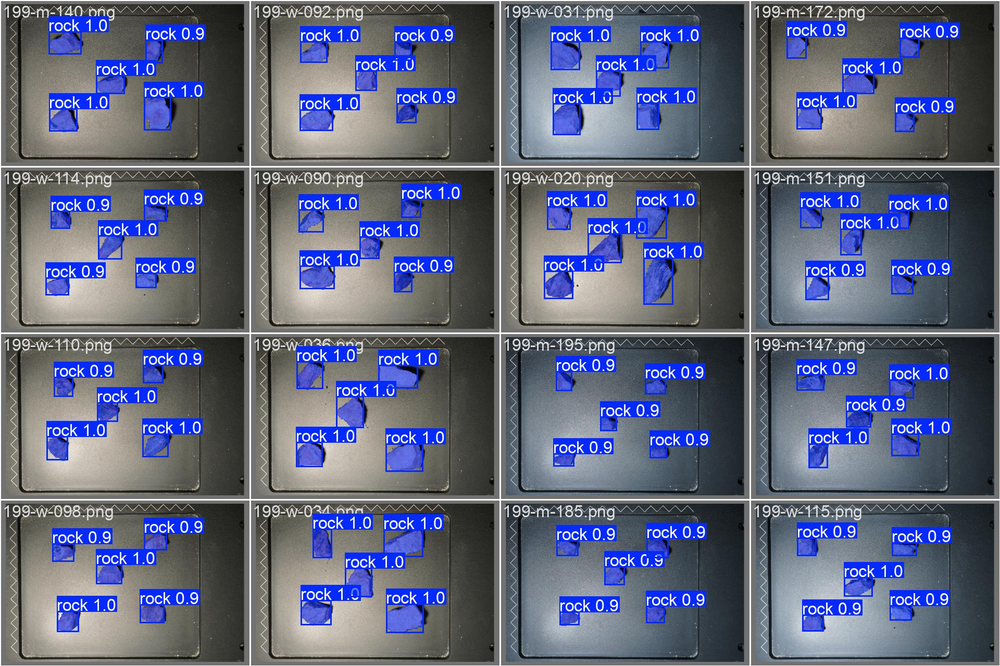
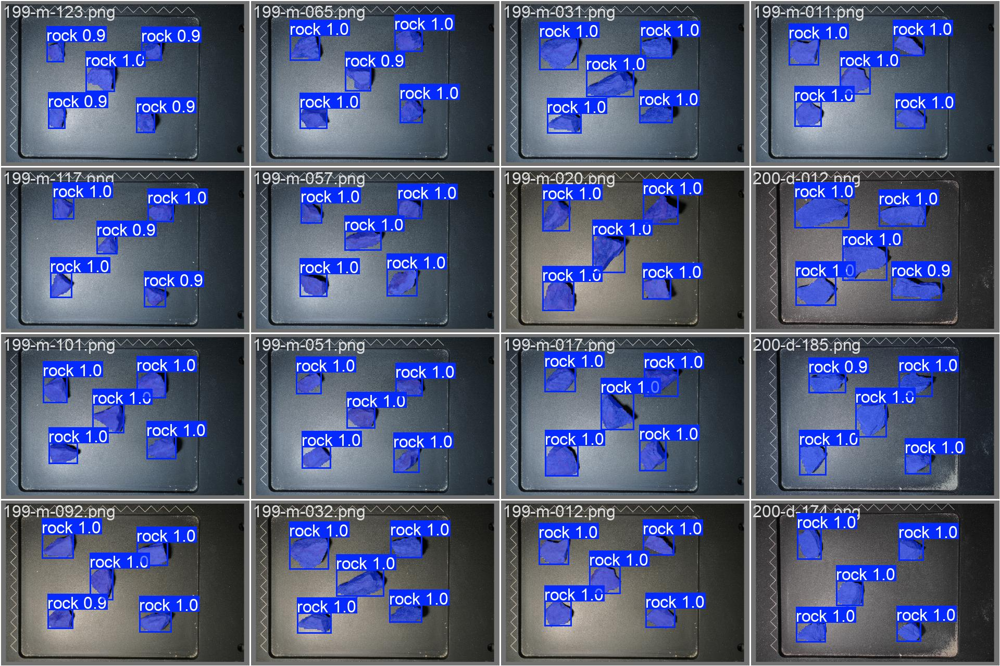
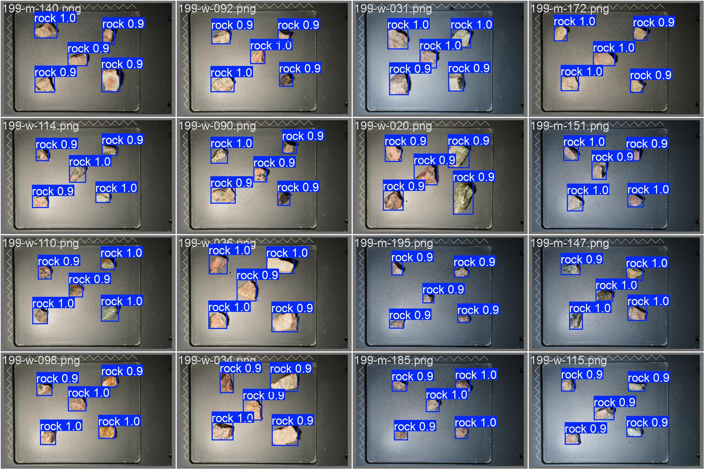
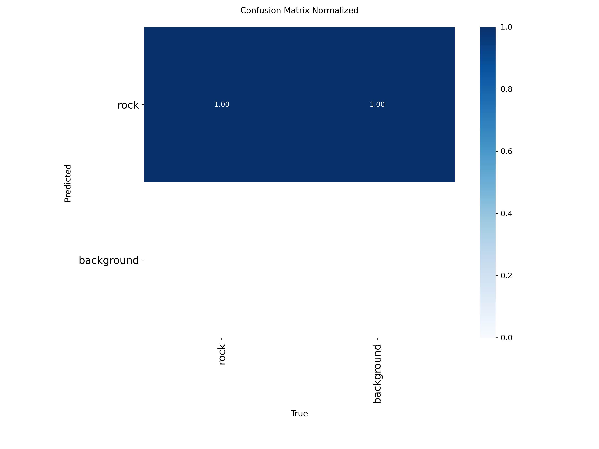
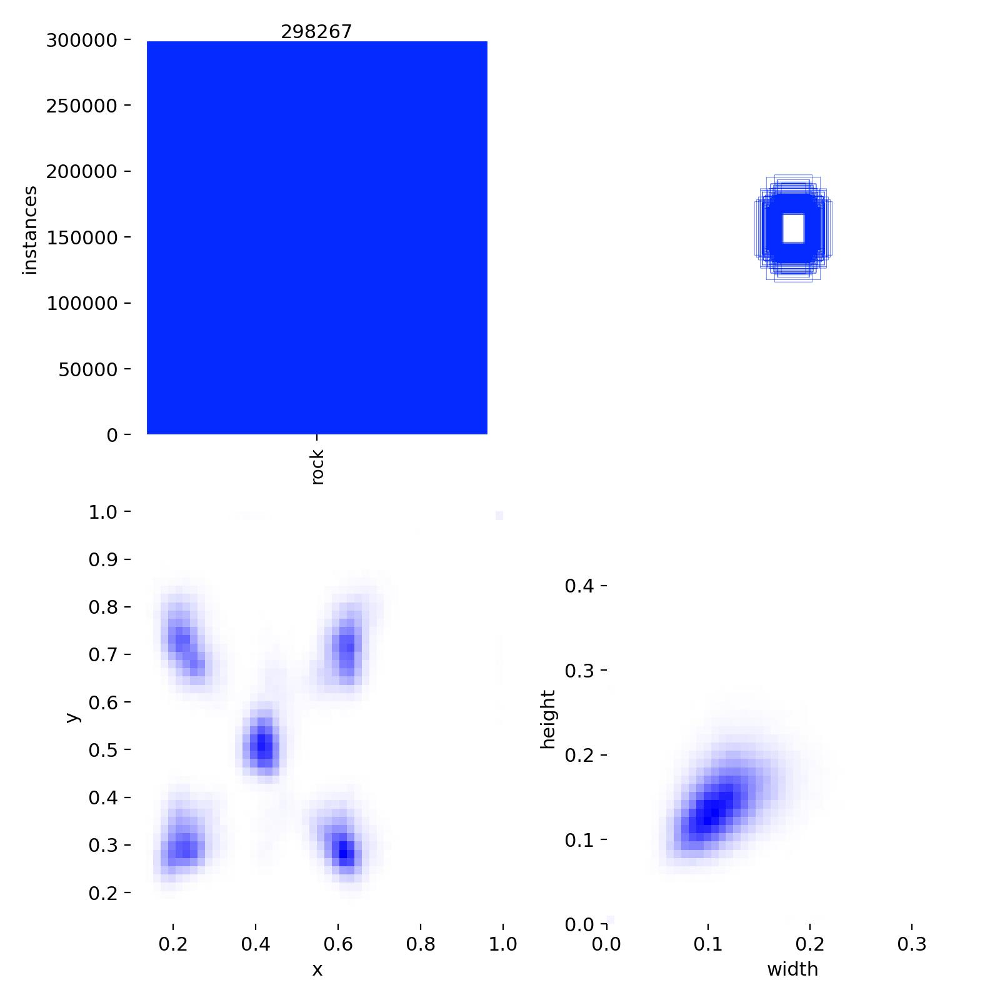
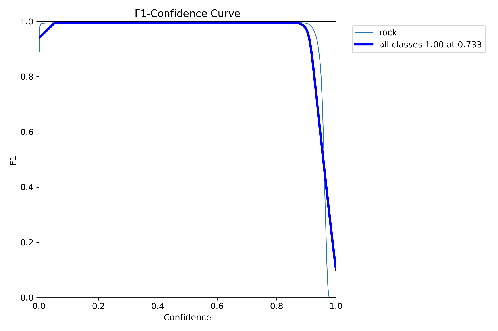

# Real-Time Aggregate Inspection: Rock Detection and Instance Segmentation

검은 트레이 위에 놓인 골재(rock/aggregate)를 자동으로 검출하고 분할하여, 실시간 또는 준실시간 검사 시스템에 적용할 수 있는지 검증한 capstone 프로젝트입니다.

이 저장소는 단순히 최종 모델만 담는 곳이 아니라, OpenCV 기반 고전 영상처리에서 YOLOv8 detection/segmentation, Mask R-CNN baseline, 추론 속도 benchmark, ROS2 통합 가능성까지 이어진 전체 시행착오를 기록합니다.

## Executive Summary

최종 결론은 다음과 같습니다.

| 항목 | 최종 판단 |
|---|---|
| 검사 대상 | 검은 tray 위 골재 instance |
| 최종 후보 | YOLOv8-seg |
| 비교 baseline | OpenCV rule-based pipeline, YOLOv8 detection, Mask R-CNN |
| 핵심 이유 | 높은 segmentation 정확도, 단순한 배포 구조, Mask R-CNN 대비 빠른 end-to-end latency |
| 대표 속도 | YOLOv8-seg 500장 benchmark 기준 mean 38.68 ms/image, mean 31.27 FPS |
| Mask R-CNN 기준 | 47.95 ms/image |
| 속도 비교 | YOLOv8-seg가 Mask R-CNN 대비 약 1.24x 빠름 |
| 실시간성 판단 | 30 FPS 근처의 near real-time 처리 가능성 확인 |

> YOLOv8-seg achieved 38.68 ms/image mean end-to-end latency and 31.27 FPS on an RTX 4060 Laptop GPU over 500 test images. Compared with the Mask R-CNN baseline reference latency of 47.95 ms/image, YOLOv8-seg was approximately 1.24x faster, supporting its suitability for near real-time aggregate inspection.

## Visual Result Snapshot

### YOLOv8-seg: 실제 골재 segmentation 결과

아래 이미지는 validation batch에 대한 YOLOv8-seg 예측 결과입니다. 실제 돌 위에 mask, bbox, confidence가 함께 표시됩니다.





### YOLOv8 detection: bbox-only baseline

Detection 모델은 빠르고 단순하지만, 입도/면적/형상 기반 검사에는 instance mask가 부족합니다.



### YOLOv8-seg 학습 및 평가 요약






### YOLOv8-seg confidence / PR curves





### Mask R-CNN baseline 평가 결과

Mask R-CNN은 accuracy 측면에서는 매우 강했지만, 학습/추론/배포 복잡도와 latency 면에서 YOLOv8-seg보다 실시간 시스템에 불리했습니다.


### YOLOv8-seg GPU speed benchmark

RTX 4060 Laptop GPU에서 500장 test sample로 측정한 end-to-end latency/FPS 결과입니다.


## Quantitative Result Tables

### Model Accuracy and Speed Comparison

| 모델 | 출력 | 대표 지표 | AP50 / mAP50 | F1 / Recall | 추론 시간 | 비고 |
|---|---|---:|---:|---:|---:|---|
| YOLOv8 detection | bbox | Box mAP50 | 0.9915 | Precision 0.9964 / Recall 0.9984 | 미측정 | 가장 단순하지만 mask 없음 |
| YOLOv8-seg | bbox + mask | Box/Mask mAP50 | Box 0.9926 / Mask 0.9926 | Precision 0.9962 / Recall 0.9963 | 38.68 ms/image | 최종 선택 후보 |
| Mask R-CNN | bbox + mask | Box/Mask AP50 | Box 0.9949 / Mask 0.9943 | Mask F1 0.9964 / Recall 0.9975 | 47.95 ms/image | 정확도 우수, 상대적으로 느림 |

### YOLOv8-seg Speed Benchmark, 500 Images

| 항목 | 값 |
|---|---:|
| GPU | NVIDIA GeForce RTX 4060 Laptop GPU |
| Images | 500 |
| Input size | 640 |
| Warmup | 30 images |
| Mean latency | 38.68 ms/image |
| Median latency | 31.40 ms/image |
| P95 latency | 58.94 ms/image |
| Mean FPS | 31.27 FPS |
| Median FPS | 31.85 FPS |
| Mean model inference time | 5.08 ms/image |
| Mean preprocess time | 2.23 ms/image |
| Mean postprocess time | 1.51 ms/image |
| Average detected instances | 5.00 |
| Mask R-CNN reference latency | 47.95 ms/image |
| Speedup vs Mask R-CNN | 1.24x |

### Mask R-CNN Test Evaluation

| 항목 | 값 |
|---|---:|
| Evaluated images | 7,385 |
| Ground-truth instances | 37,220 |
| Predicted instances | 37,394 |
| Box precision best | 0.9957 |
| Box recall best | 0.9979 |
| Box F1 best | 0.9968 |
| Box AP50 | 0.9949 |
| Mask precision best | 0.9954 |
| Mask recall best | 0.9975 |
| Mask F1 best | 0.9964 |
| Mask AP50 | 0.9943 |
| Inference time | 47.95 ms/image |

## Why This Project Exists

골재 검사에서는 단순히 “돌이 있다/없다”만 알면 부족합니다. 실제 검사 시스템은 다음 정보를 안정적으로 얻어야 합니다.

- 개별 골재 instance 개수
- 각 골재의 위치와 크기
- 면적, 형상, 경계, 입도 분석에 사용할 수 있는 mask
- 실시간 처리에 가까운 latency
- 조명/반사/검은 tray 배경에서도 견디는 robustness

초기에는 OpenCV 기반 rule-based 방식으로 충분해 보였지만, 실제 이미지에서는 조명, 그림자, 흰 반사, 돌 간 접촉, tray 경계, 돌 색상 편차가 커서 고정 threshold와 contour 기반 접근만으로는 안정적인 instance segmentation을 만들기 어려웠습니다.

그래서 프로젝트는 다음 순서로 발전했습니다.

1. OpenCV threshold/edge/contour 기반 detector 구현
2. 반사 제거, local contrast, morphology, contour refine 등 규칙 기반 개선
3. YOLOv8 detection 데이터셋 구축
4. YOLOv8-seg polygon label 생성
5. Mask R-CNN용 COCO 변환과 baseline 구현
6. YOLOv8-seg와 Mask R-CNN 정량 비교
7. YOLOv8-seg GPU latency benchmark
8. 실시간 골재 검사 시스템 후보로 YOLOv8-seg 선택

## Trial and Error Log

### 1. Classical OpenCV Pipeline

처음에는 검은 tray와 돌의 밝기 차이를 이용하면 threshold 기반 segmentation이 가능하다고 판단했습니다.

시도한 접근:

- grayscale threshold
- HSV 기반 마스크
- Canny edge
- morphology close/open
- contour area filtering
- tray ROI filtering
- reflection mask 제거
- local contrast / local standard deviation
- delta-L 기반 seed mask
- contour refinement

배운 점:

- 단일 threshold는 조명 변화에 약함
- 흰 반사 영역이 돌 내부/외부 모두에서 생겨 false positive를 유발
- 돌끼리 붙으면 contour가 하나로 합쳐짐
- tray edge와 shadow가 돌처럼 잡힘
- 고전 영상처리는 debug 가능성은 좋지만, 다양한 촬영 조건에서 유지보수 비용이 큼

결론:

- OpenCV pipeline은 데이터 이해와 label 품질 점검에는 유용함
- 하지만 최종 실시간 검사 시스템의 주 detector로 쓰기에는 robustness가 부족함

### 2. YOLOv8 Detection

Detection 모델은 bbox 기준으로 매우 높은 정확도를 보였습니다.

장점:

- 학습과 추론이 단순함
- bbox mAP가 높음
- 배포가 쉬움

한계:

- bbox만으로는 실제 돌 면적/형상/입도 계산이 부정확함
- 겹치거나 붙어 있는 돌의 경계 분석에 부족함
- 검사 시스템에서 필요한 instance mask를 제공하지 않음

결론:

- “돌 위치 검출”만 목표라면 충분히 강력함
- “골재 검사”에는 segmentation이 더 적합함

### 3. YOLOv8 Segmentation

원본 polygon annotation을 YOLO segmentation label로 변환하여 YOLOv8-seg를 학습했습니다.

장점:

- bbox와 mask를 동시에 제공
- Mask R-CNN보다 inference pipeline이 단순함
- Ultralytics 결과물로 PR curve, confusion matrix, labels plot, results plot이 자동 생성됨
- GPU benchmark에서 31 FPS 수준 확인

고민한 점:

- mask AP50-95는 Box mAP50-95보다 낮게 나올 수 있음
- confidence threshold에 따라 instance 수가 민감하게 달라질 수 있음
- end-to-end latency에는 image loading, preprocess, postprocess가 포함되어야 실제 시스템 판단에 유효함

결론:

- 정확도와 속도 균형이 가장 좋음
- 실시간 골재 검사 시스템의 최종 후보로 적합함

### 4. Mask R-CNN Baseline

YOLOv8-seg만으로 결론을 내리지 않기 위해 torchvision Mask R-CNN baseline을 따로 구현했습니다.

구현한 것:

- YOLO segmentation label을 COCO JSON으로 변환
- `RockCocoDataset`
- Mask R-CNN train/evaluate/infer scripts
- YOLO 스타일 평가 plot 생성
- Box/Mask PR, F1-confidence, confusion matrix, labels plot, results summary

배운 점:

- Mask R-CNN은 instance segmentation accuracy가 매우 좋음
- 큰 이미지와 mask tensor 때문에 학습/평가 메모리 부담이 큼
- DataLoader 병목과 긴 epoch 때문에 진행 로그가 반드시 필요함
- 실시간 배포 관점에서는 YOLOv8-seg보다 무겁고 복잡함

결론:

- 성능 비교 baseline으로는 매우 유용함
- 최종 realtime detector로는 YOLOv8-seg가 더 현실적임

## Repository Structure

```text
capstone/
├─ README.md
├─ build_rock_det_dataset.py
├─ build_rock_seg_labels.py
├─ benchmark_yolo_seg_speed.py
├─ final_result/
│  ├─ det_result/
│  ├─ seg_result/
│  ├─ maskrcnn_rock/eval_test/
│  ├─ yolo_seg_benchmark_gpu_smoke/
│  └─ yolo_seg_benchmark_sample/
├─ maskrcnn_pipeline/
│  ├─ coco_converter.py
│  ├─ train_maskrcnn.py
│  ├─ evaluate_maskrcnn.py
│  ├─ infer_maskrcnn.py
│  ├─ dataset/rock_coco_dataset.py
│  ├─ models/maskrcnn.py
│  └─ utils/
├─ src/seg_opencv/
│  ├─ aggregate_inspection_cv.py
│  ├─ compare_presets.py
│  ├─ stone.py
│  ├─ stone_detect.py
│  ├─ stone_detect_pf.py
│  └─ stone_detector_refined.py
└─ ros2_ws/
```

## Important Scripts

| 파일 | 목적 |
|---|---|
| `build_rock_det_dataset.py` | 원본 JSON polygon annotation에서 YOLO detection dataset 생성 |
| `build_rock_seg_labels.py` | polygon annotation을 YOLO segmentation label로 변환 |
| `benchmark_yolo_seg_speed.py` | YOLOv8-seg 추론 latency/FPS benchmark 및 plot 생성 |
| `src/seg_opencv/stone_detector_refined.py` | OpenCV 기반 refined detector |
| `maskrcnn_pipeline/coco_converter.py` | YOLO segmentation label을 COCO JSON으로 변환 |
| `maskrcnn_pipeline/train_maskrcnn.py` | torchvision Mask R-CNN 학습 |
| `maskrcnn_pipeline/evaluate_maskrcnn.py` | Mask R-CNN 평가 및 YOLO 스타일 plot 생성 |
| `maskrcnn_pipeline/infer_maskrcnn.py` | Mask R-CNN 단일 이미지 추론 |

## Data and Label Formats

| 데이터 | 형식 |
|---|---|
| 원본 이미지 | `png`, `jpg`, `jpeg`, `bmp` |
| 원본 annotation | custom JSON polygon |
| YOLO detection label | `class cx cy w h` |
| YOLO segmentation label | `class x1 y1 x2 y2 ...` |
| Mask R-CNN label | COCO-style `train.json`, `val.json`, `test.json` |
| 모델 weight | `.pt`, `.pth`, `.onnx` |
| 결과 요약 | `.csv`, `.json`, `.txt`, `.png`, `.jpg` |

원본 데이터셋과 생성된 학습 데이터셋은 크기가 크기 때문에 git에 포함하지 않습니다. README에 필요한 대표 결과물은 `final_result/`에 정리해 포함합니다.

## Reproduction Commands

### Build YOLO detection dataset

```bash
python3 build_rock_det_dataset.py \
  --project-root /home/sanghwon/capstone \
  --clean
```

### Build YOLO segmentation labels

```bash
python3 build_rock_seg_labels.py
```

### Convert YOLO segmentation labels to COCO for Mask R-CNN

```bash
python3 -m maskrcnn_pipeline.coco_converter \
  --dataset-root /home/sanghwon/capstone/datasets/rock_det \
  --output-dir /home/sanghwon/capstone/maskrcnn_pipeline/dataset
```

### Train Mask R-CNN with progress logs

```bash
python3 -u -m maskrcnn_pipeline.train_maskrcnn \
  --epochs 1 \
  --batch-size 2 \
  --lr 1e-4 \
  --log-interval 20 \
  --debug-first-batch \
  --profile-data-time
```

### Evaluate Mask R-CNN with YOLO-style plots

```bash
python3 -u -m maskrcnn_pipeline.evaluate_maskrcnn \
  --weights /home/sanghwon/capstone/maskrcnn_pipeline/runs/maskrcnn_rock/best.pth \
  --split test \
  --conf-thres 0.001 \
  --iou-thres 0.5 \
  --output-dir /home/sanghwon/capstone/runs/maskrcnn_rock/eval_test \
  --num-workers 4
```

### Benchmark YOLOv8-seg speed on GPU

```bash
python3 -u /home/sanghwon/capstone/benchmark_yolo_seg_speed.py \
  --model /home/sanghwon/capstone/runs/rock_seg_sanity/weights/best.pt \
  --source /home/sanghwon/capstone/datasets/rock_det/images/test \
  --imgsz 640 \
  --device 0 \
  --conf 0.25 \
  --max-images 500 \
  --warmup 30 \
  --output-dir /home/sanghwon/capstone/runs/yolo_seg_benchmark_sample \
  --maskrcnn-ms 47.95
```

### Benchmark ONNX export

```bash
python3 -u /home/sanghwon/capstone/benchmark_yolo_seg_speed.py \
  --model /home/sanghwon/capstone/runs/rock_seg_sanity/weights/best.onnx \
  --source /home/sanghwon/capstone/datasets/rock_det/images/test \
  --imgsz 640 \
  --device 0 \
  --conf 0.25 \
  --max-images 500 \
  --warmup 30 \
  --output-dir /home/sanghwon/capstone/runs/yolo_seg_benchmark_onnx_sample \
  --maskrcnn-ms 47.95
```

## What Gets Committed

This repository intentionally separates source code, final report artifacts, and local-heavy artifacts.

Committed:

- source scripts
- Mask R-CNN pipeline source code
- `final_result/` report-ready plots, CSV, JSON, TXT
- README documentation

Not committed:

- raw images
- generated YOLO dataset
- generated COCO dataset JSON files
- model weights (`.pt`, `.pth`, `.onnx`)
- local `runs/`
- exploratory `result/`
- ROS2 build/install/log outputs

This keeps the GitHub repository readable while still showing enough visual and quantitative evidence to understand the project.

## Final Takeaway

OpenCV helped expose the image formation problems: black tray, reflection, shadows, touching stones, and contour instability. YOLOv8 detection proved that the rock objects are learnable with high bbox accuracy. Mask R-CNN proved that high-quality instance segmentation is possible, but with heavier inference and deployment cost. YOLOv8-seg delivered the best balance: strong instance masks, high validation metrics, simple deployment, and near real-time throughput on the available RTX 4060 Laptop GPU.

Therefore, YOLOv8-seg is the most practical final model for the aggregate inspection pipeline in this project.
