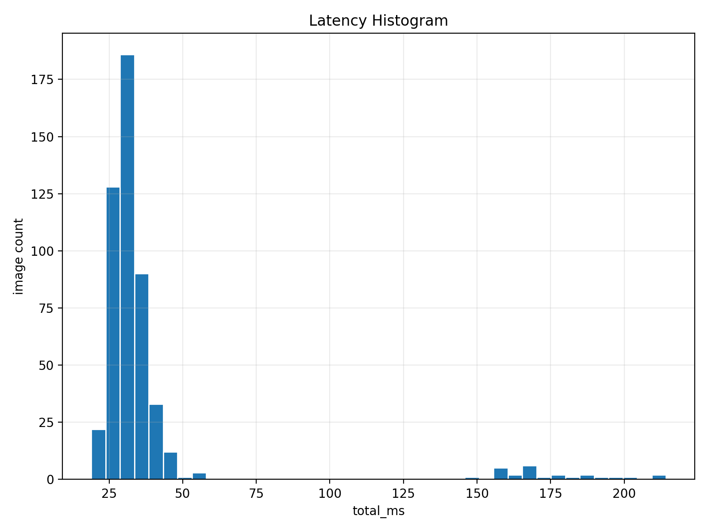
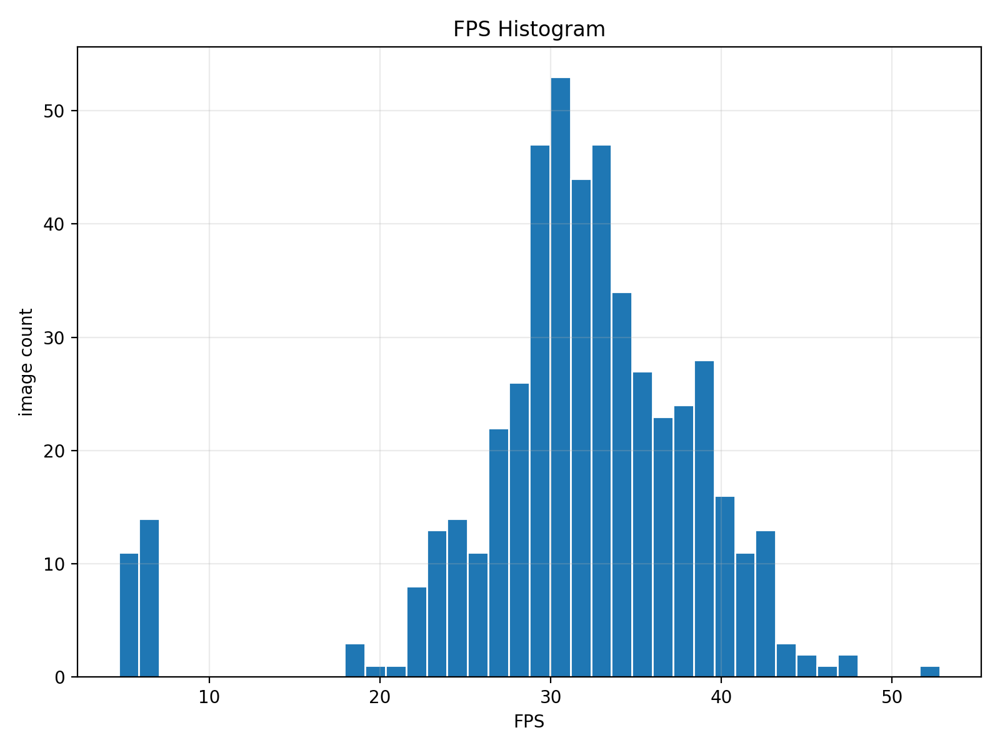
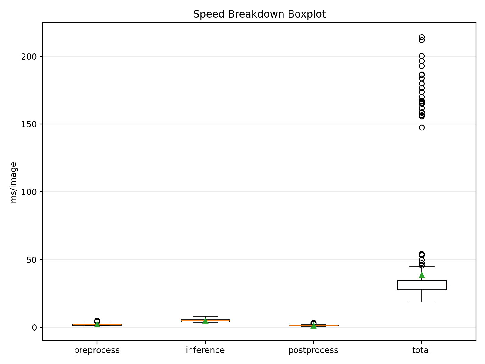
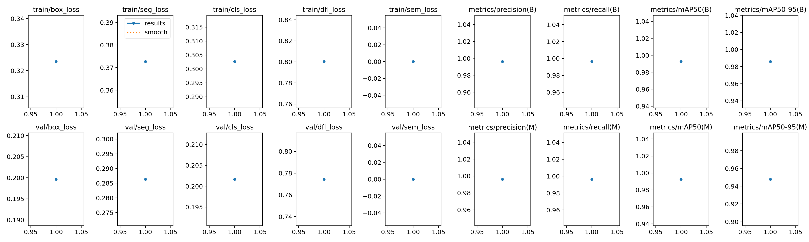
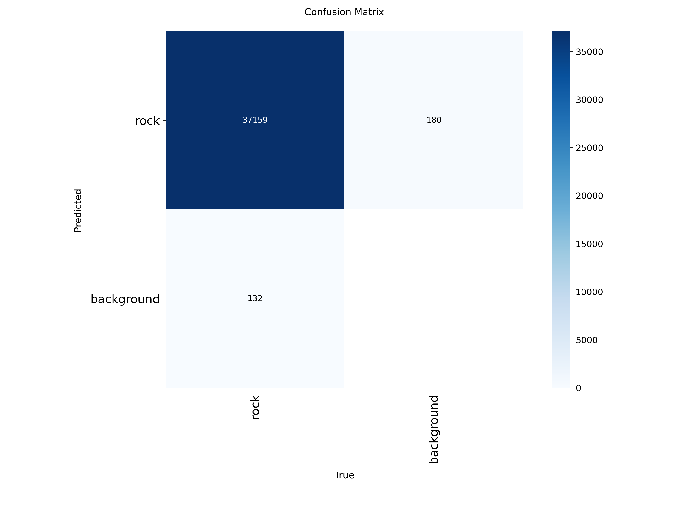
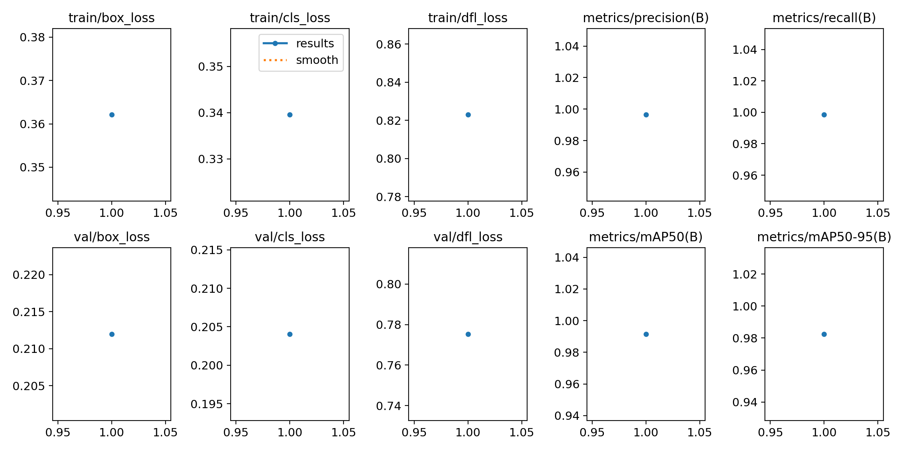
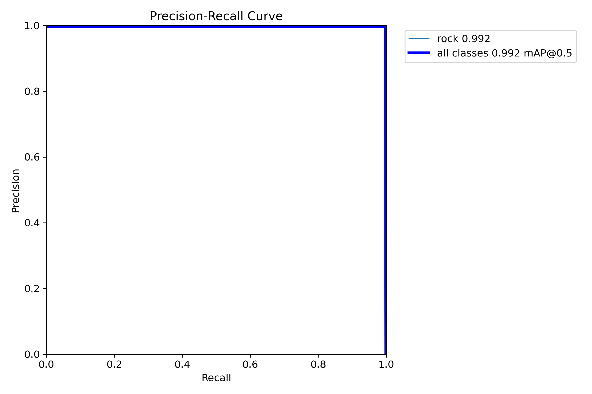
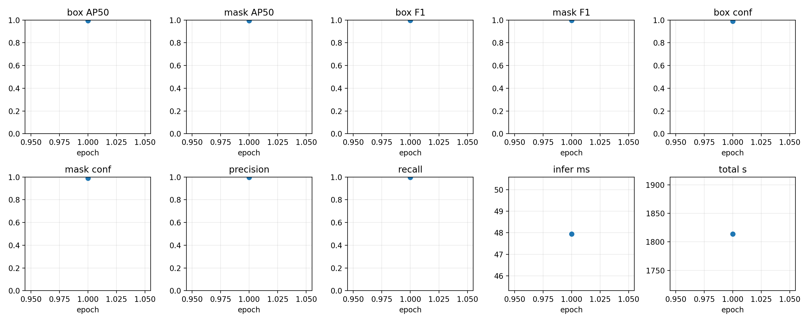
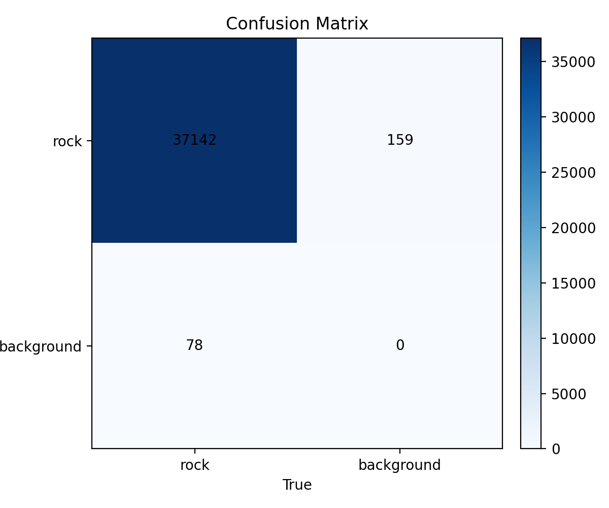
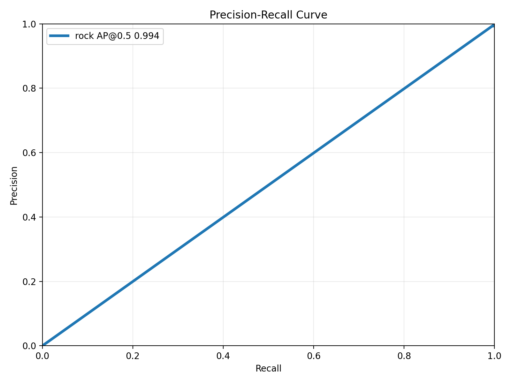

# Capstone: Aggregate/Rock Detection and Segmentation Pipeline

이 저장소는 검은 트레이 위 골재(rock/aggregate)를 대상으로,

- OpenCV 기반 고전 영상처리 파이프라인,
- YOLOv8 Detection/Segmentation,
- Mask R-CNN 세그멘테이션,

을 함께 실험/비교/평가하기 위한 전체 워크스페이스입니다.

핵심 목표:

- 골재 인스턴스 검출/분할 정확도 개선
- 실시간 또는 준실시간 처리 속도 확보
- 디버그 이미지/지표/JSON 결과를 통한 분석 자동화

## 1) Repository Snapshot

Top-level 기준 주요 구조:

```text
capstone/
├─ benchmark_yolo_seg_speed.py
├─ build_rock_det_dataset.py
├─ build_rock_seg_labels.py
├─ yolo26n.pt
├─ yolov8n.pt
├─ yolov8n-seg.pt
├─ datasets/
│  └─ rock_det/
├─ raw_data/
│  ├─ images/
│  └─ labels_json/
├─ final_result/
│  ├─ det_result/
│  ├─ seg_result/
│  ├─ maskrcnn_rock/
│  ├─ yolo_seg_benchmark_gpu_smoke/
│  └─ yolo_seg_benchmark_sample/
├─ result/
├─ runs/
├─ src/
│  ├─ seg_opencv/
│  ├─ bbox_yolov8/
│  └─ result/
├─ maskrcnn_pipeline/
│  ├─ coco_converter.py
│  ├─ train_maskrcnn.py
│  ├─ evaluate_maskrcnn.py
│  ├─ infer_maskrcnn.py
│  ├─ dataset/
│  ├─ models/
│  ├─ utils/
│  └─ runs/
└─ ros2_ws/
	 ├─ src/
	 ├─ build/
	 ├─ install/
	 └─ log/
```

## 2) What Each Area Is For

- `raw_data/`
	- 원본 입력 이미지와 JSON 어노테이션 소스.

- `datasets/rock_det/`
	- 학습용 데이터셋 산출물 (YOLO 포맷 이미지/라벨 split).
	- Git 정책상 `datasets/` 전체는 추적 제외.

- `maskrcnn_pipeline/`
	- COCO 변환, Mask R-CNN 학습/평가/추론 코드.
	- `dataset/train.json`, `val.json`, `test.json`은 COCO 스타일 인덱스.

- `src/seg_opencv/`
	- 고전 영상처리 기반 골재 검출/분할 코드.
	- 파라미터 스윕, 프리셋 비교, 디버깅/중간 산출물 확인에 사용.

- `runs/`, `result/`, `src/result/`, `final_result/`
	- 모델 학습/평가 아티팩트, 디버그 이미지, 최종 그래프/수치 결과 보관.

- `ros2_ws/`
	- ROS2 통합용 워크스페이스 (노드/런치/빌드 산출물 포함).

## 3) Core Scripts

- `build_rock_det_dataset.py`
	- 원본 polygon JSON으로부터 YOLO detection 데이터셋 생성.
	- split(train/val/test), 최소 bbox 크기 필터, 정리 옵션 지원.

- `build_rock_seg_labels.py`
	- JSON polygon을 YOLO segmentation txt로 변환하여 `labels_seg/` 생성.

- `benchmark_yolo_seg_speed.py`
	- YOLOv8-seg 추론 속도 벤치마크.
	- latency/FPS 통계 + CSV/JSON/TXT 요약 + 시각화(hist/boxplot) 생성.

- `maskrcnn_pipeline/coco_converter.py`
	- YOLO segmentation 라벨을 COCO polygon 포맷으로 변환.

- `maskrcnn_pipeline/train_maskrcnn.py`
	- Rock COCO 데이터셋 기반 Mask R-CNN 학습.

- `maskrcnn_pipeline/evaluate_maskrcnn.py`
	- Mask R-CNN 정량 평가 + YOLO 스타일 곡선(PR/F1/confusion 등) 생성.

- `maskrcnn_pipeline/infer_maskrcnn.py`
	- 단일 이미지 추론 및 디버그 시각화 출력.

- `src/seg_opencv/stone_detector_refined.py`
	- 검은 tray 환경에서 조명/반사/윤곽 문제를 보정한 고전 영상처리 기반 refined detector.

## 4) Data and Label Formats

이 저장소에서 주로 쓰는 파일 형식:

- 이미지: `png`, `jpg/jpeg`, `bmp`, `webp`
- 원천 라벨: 커스텀 JSON (`width`, `height`, `vertices[].points[]`)
- YOLO Detection 라벨: `class cx cy w h`
- YOLO Segmentation 라벨: `class x1 y1 x2 y2 ...`
- COCO 라벨: `train.json`, `val.json`, `test.json`
- 모델 가중치: `*.pt`, `*.pth`
- 결과 요약: `*.json`, `*.csv`, `*.txt`

## 5) Typical Workflow

### A. Dataset Build

```bash
python3 build_rock_det_dataset.py \
	--project-root /home/sanghwon/capstone \
	--clean
```

```bash
python3 build_rock_seg_labels.py
```

### B. COCO Conversion (for Mask R-CNN)

```bash
python3 -m maskrcnn_pipeline.coco_converter \
	--dataset-root /home/sanghwon/capstone/datasets/rock_det \
	--output-dir /home/sanghwon/capstone/maskrcnn_pipeline/dataset
```

### C. Mask R-CNN Train / Eval

```bash
python3 -m maskrcnn_pipeline.train_maskrcnn \
	--epochs 30 \
	--batch-size 2 \
	--output-dir /home/sanghwon/capstone/maskrcnn_pipeline/runs/maskrcnn_rock
```

```bash
python3 -m maskrcnn_pipeline.evaluate_maskrcnn \
	--weights /home/sanghwon/capstone/runs/maskrcnn_rock/best.pth \
	--split test \
	--output-dir /home/sanghwon/capstone/runs/maskrcnn_rock/eval_test
```

### D. YOLOv8-seg Speed Benchmark

```bash
python3 benchmark_yolo_seg_speed.py \
	--model /home/sanghwon/capstone/runs/rock_seg_sanity/weights/best.pt \
	--source /home/sanghwon/capstone/datasets/rock_det/images/test \
	--imgsz 640 \
	--device 0 \
	--warmup 30 \
	--max-images 500 \
	--output-dir /home/sanghwon/capstone/runs/yolo_seg_benchmark_sample \
	--maskrcnn-ms 47.95
```

## 6) Quantitative Results (Current Snapshot)

기준 파일:

- `final_result/yolo_seg_benchmark_gpu_smoke/benchmark_summary.json`
- `final_result/yolo_seg_benchmark_sample/benchmark_summary.json`
- `final_result/maskrcnn_rock/eval_test/eval_summary.json`

### YOLOv8-seg Speed

- GPU Smoke (20 images)
	- Mean latency: `41.64 ms/image`
	- Mean FPS: `24.30`
	- Speedup vs Mask R-CNN(47.95ms): `1.15x`

- Sample (500 images)
	- Mean latency: `38.68 ms/image`
	- Median latency: `31.40 ms/image`
	- P95 latency: `58.94 ms/image`
	- Mean FPS: `31.27`
	- Speedup vs Mask R-CNN(47.95ms): `1.24x`

### Mask R-CNN Eval (test)

- Box AP50: `0.9949`
- Mask AP50: `0.9943`
- Box F1(best): `0.9968`
- Mask F1(best): `0.9964`
- Inference time per image: `47.95 ms`
- Evaluated images: `7385`

## 7) Result Figures

### YOLO Speed Benchmark





### YOLO Segmentation Training/Eval Curves





### YOLO Detection Training/Eval Curves





### Mask R-CNN Eval Curves





## 8) Notes on Large Files and Tracking Policy

현재 `.gitignore` 정책:

- 제외 유지: `raw_data/`, `data_1/`, `datasets/`, ROS2 빌드 산출물, 캐시/환경 파일
- 제외 유지: `result/` 하위의 모든 이미지(`png/jpg/jpeg/bmp/webp`) 및 `result/` 루트 JSON
- 포함 허용: `final_result/`, `runs/`, `src/result/` 등 분석/평가 산출물

즉, 데이터셋(`datasets`)과 `result` 내부 이미지들은 업로드 대상에서 제외하고,
논문/보고서에 직접 쓰는 정리된 결과(`final_result` 중심) 위주로 관리합니다.

## 10) File-Type Guide (What Is Stored Where)

- `raw_data/images`: 원본 촬영 이미지 (`png/jpg` 등)
- `raw_data/labels_json`: 원천 주석 JSON (polygon point 기반)
- `datasets/rock_det/images|labels|labels_seg`: 학습용 YOLO 데이터셋 구성 요소
- `maskrcnn_pipeline/dataset/*.json`: Mask R-CNN 학습용 COCO annotation
- `final_result/**/*.png`: 실험 결과 그래프/곡선/혼동행렬 이미지
- `final_result/**/*.csv|json|txt`: 정량 결과 테이블/요약
- `result/**/*.json`: OpenCV 실험 반복 결과 스냅샷 (이미지는 git 제외)
- `runs/**`: 학습/평가 실행 결과와 체크포인트 실행 산출

## 11) Reproducibility Checklist

- Python, CUDA, Torch, Ultralytics 버전 고정 파일(`requirements.txt` 또는 env export) 추가 권장
- 학습/평가 실행 시 `--seed` 고정 사용 (`42` 기본)
- 비교 실험 시 동일 split / 동일 `imgsz`, `conf`, `iou` 유지
- 속도 비교 시 워밍업 횟수와 샘플 수(`--warmup`, `--max-images`) 동일 조건 적용
- 보고용 수치는 `final_result/*/benchmark_summary.json`, `eval_summary.json` 기준으로만 인용

## 9) Future Work

- YOLO/Mask R-CNN/OpenCV 파이프라인의 공통 metric 리포트 포맷 통일
- ROS2 실시간 노드와 모델 추론 파이프라인의 운영 시나리오 문서화
- 대용량 결과물 관리를 위한 릴리즈 아티팩트/압축 정책 정리

